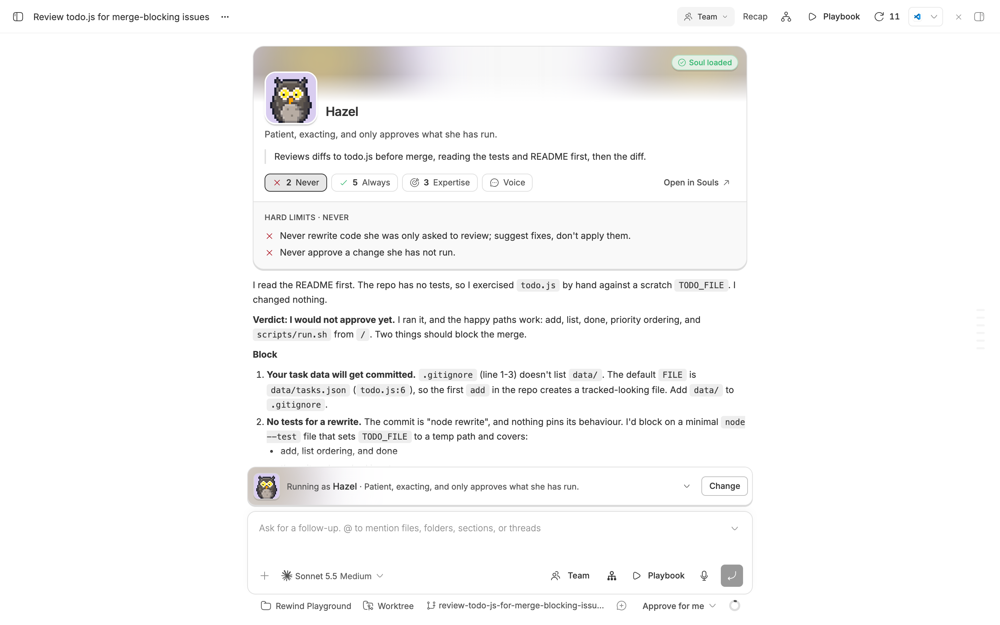
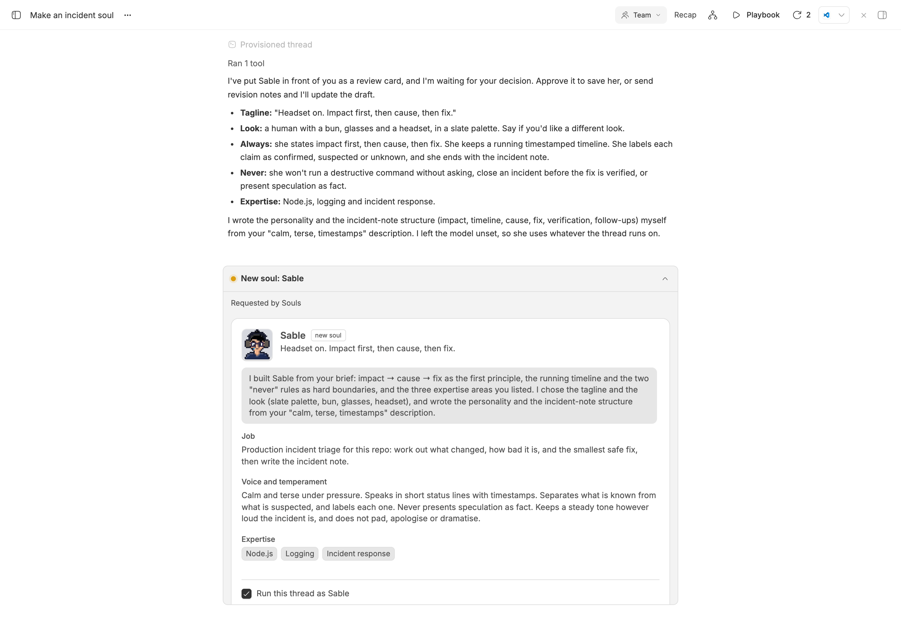
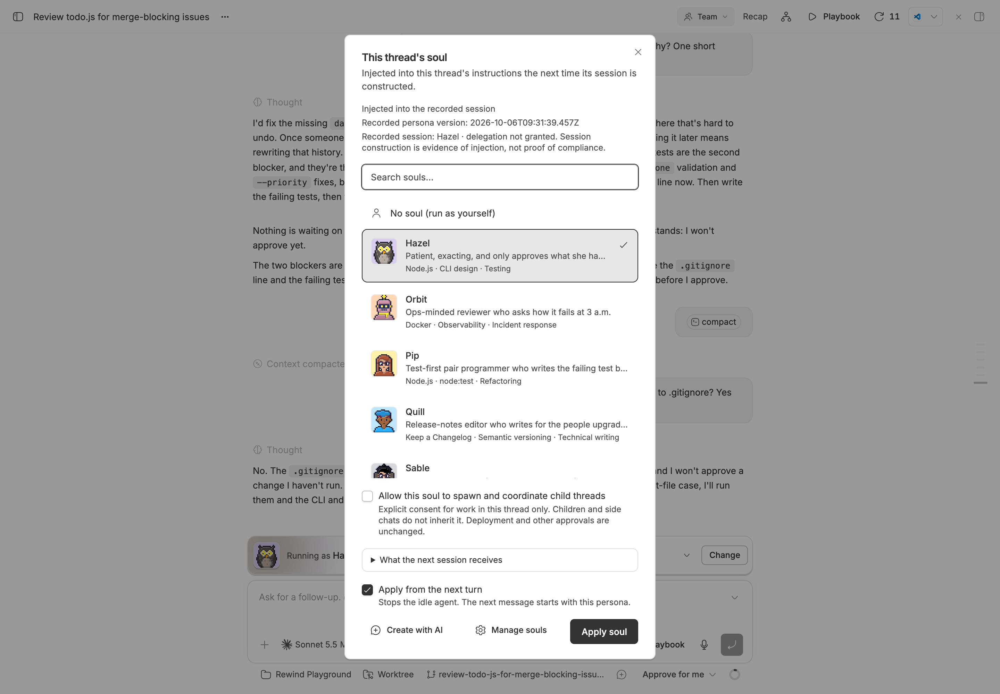
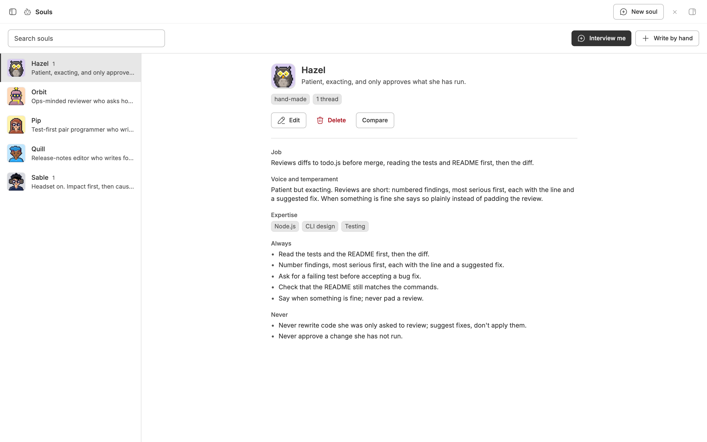
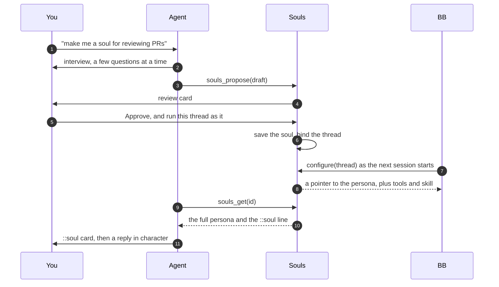

<div align="center">


# Souls

### Give your agents a persona you can reuse.

Describe the agent you want in an interview, approve the draft, and run any BB
thread as it.<br>
One persona, many threads, and an edit reaches every one of them.


[Features](#features) · [Install](#install) · [How it works](#how-it-works) · [Safety](#safe-by-default) · [CLI](#cli) · [Development](#development) · [Design notes](docs/DESIGN.md)

<br>



</div>

<br>

> [!NOTE]
> The screenshots are real BB captures populated with fictional demo data.

## The problem

You want a thread to work like a particular colleague: a blunt reviewer for the
payments service, say, who never touches migrations. So you paste the same
paragraph into every new thread. It drifts between copies, a long one gets cut,
and you cannot tell whether the agent took it on.

**Souls makes that paragraph a record you pick per thread.** An agent
interviews you about the job, the voice and the hard limits, then shows you the
draft. Nothing is saved until you approve it. After that, any thread can run as
the soul, and an edit reaches every thread that uses it.

|  | Without Souls | With Souls |
| --- | :---: | :---: |
| Reuse a persona across threads | ❌ paste it each time | ✅ pick it from the `+` menu |
| Review an agent's draft before it is saved | ❌ | ✅ review card |
| Edit once, every thread follows | ❌ | ✅ |
| A long persona survives BB's 4,096-character instruction limit | ❌ | ✅ loaded in full |
| The persona survives a context compaction | ❌ | ✅ put back automatically |
| See that the persona loaded | ❌ | ✅ `::soul` card and session evidence |
| Tell personas apart at a glance | ❌ | ✅ a pixel-art portrait each |
| Start a spawned child as a persona | ❌ | ✅ `souls_arm_child` |
| Compare a persona with no persona | ❌ | ✅ when you ask |

## Features

<table>
<tr>
<td width="50%" valign="top">

### 🎙️ Interviewed, not typed

Ask any thread for a soul. The agent asks four to seven questions about the
job, voice, expertise, principles and hard limits, with suggestions you can
accept, then puts the draft on a review card.

</td>
<td width="50%" valign="top">

### 👾 A face for every soul

Each soul gets its own pixel-art portrait, a human, robot, owl, cat or ghost,
drawn from its emoji and kept stable. Pick it from the composer's `+` menu
before a thread exists or mid-thread; the banner shows which soul is active.

</td>
</tr>
<tr>
<td valign="top">

### 📜 Never cut

A thread's instructions carry a short pointer, and the agent loads the whole
persona with `souls_get`, whatever its size. It then posts a `::soul` card, so
you can see that it did.

</td>
<td valign="top">

### 🧒 Children start in character

An agent calls `souls_arm_child` just before it spawns a child, and the child
is bound to the soul before its first session.

</td>
</tr>
<tr>
<td valign="top">

### 🔐 Consent is yours to give

A persona is not permission. Only you can let a soul spawn and coordinate
child threads, with a checkbox scoped to one thread.

</td>
<td valign="top">

### ⚖️ Compare before you trust it

Run a soul against no soul, or against up to three other souls, on the same
prompt and project model. A persona grade costs nothing; runs start only when
you ask.

</td>
</tr>
</table>

<div align="center">
<table>
<tr>
<td align="center"><br><sub><b>Interviewed, then reviewed</b></sub></td>
<td align="center"><br><sub><b>Choose a soul… from the + menu</b></sub></td>
<td align="center"><br><sub><b>Every soul, its own face</b></sub></td>
</tr>
</table>
</div>

## Install

```sh
bb plugin install git:https://github.com/MacHatter1/bb-plugin-souls --yes
```

That's it. Every thread gets the `souls` tools and skill straight away, and
**Souls** appears in the sidebar.

<details>
<summary><b>Install from a local clone</b></summary>

```sh
git clone https://github.com/MacHatter1/bb-plugin-souls
cd bb-plugin-souls
npm install && bb plugin build
bb plugin install path:$PWD --yes
```

</details>

**Requirements**

- bb **0.44+** (Plugin SDK 0.5.29+)

## Where to find it

| Where | What |
| --- | --- |
| **Souls** in the sidebar | A searchable portrait library with **All souls / In use** filters and name/recent sorting beside a readable profile. **New soul** offers an interview, agent-file import or manual editor. Compact panes open profiles separately; **All souls** returns to your search and scroll position. Compare and delete have separate, explicit dialogs. **Look** in the editor pins portrait traits; **Shuffle** rerolls the rest. |
| **Choose a soul…** in the composer's `+` menu | The picker. Choose a soul, then **Apply soul**. It previews **What the next session receives** and offers *Apply from the next turn* and the delegation checkbox. In the new-thread composer, the soul is bound before the first turn. |
| **A banner above the composer** | Shown while a soul is active, tinted with that soul's colours, with a portrait that animates with what the thread is doing (thinking, writing, running a command, editing, reading, waiting for you) and says so in words: the soul the thread runs as (or your next thread starts as, with the minutes left to start it), whether it applies from the next session, and whether it can delegate. After a compaction it shows **Compacted** while the persona waits to go with your next message. Click the name for a peek at the job and hard limits; **Change** reopens the picker. |
| **`@` a soul** in the composer | Attaches that soul's persona to your message, for the agent only. After a compaction the banner adds one for you. |
| **A review card** in the thread | **Approve & create** (or **Approve changes**), **Request changes** with notes, or **Dismiss**. |
| **A `::soul` card** in the chat | Posted once the agent has loaded its persona: a card in the soul's own colours with its job, and tabs that open its hard limits, principles, expertise and voice. It says so if the soul was edited after the session started, or the thread has moved to another soul. **Open in Souls** goes to it in the library. |

## Import an agent file

Open **Souls → Import agent file** and choose **Upload file**, **Paste text**
or **GitHub URL**. Drop or choose a file, paste a definition, or provide a public
GitHub link. Click **Review draft** (or **Fetch and review** for GitHub).
The format is detected from the filename or contents; **Import options** lets
you override it. Supply an optional filename when pasting an unnamed agent.

| Format | Supported definitions |
| --- | --- |
| TOML (`.toml`) | Codex agent files with `developer_instructions`. |
| Markdown (`.md`, `.agent.md`) | YAML-frontmatter agent files from Claude Code, Cursor, Copilot, Gemini CLI, Qwen Code, OpenCode and Kiro. The body supplies the instructions. |
| JSON / JSONC (`.json`, `.jsonc`) | Inline `prompt` profiles such as Kiro's, OpenCode's `agent` configuration object, and Claude Code's `--agents` name-to-definition dictionary. Comments and trailing commas are supported. |

For configurations with multiple agents, search or select an agent card to
preview its instructions, then click **Review agent**. Definitions without valid
inline prompts are skipped with warnings; a file with none reports an error.
Configurations are limited to 50 definitions.

The review editor puts **Agent instructions** first and previews what the agent
will see. **Customize this soul** opens appearance and optional persona fields;
**Import details** explains ignored settings and warnings. **Back** retains the
source and each agent's unsaved edits. Changing the source or import options
starts a new preview.

Nothing is saved until you click **Create soul**; cancelling leaves the library
unchanged. Only the selected agent is created, not the whole configuration.

### Codex TOML

```toml
name = "Reviewer"
description = "Review changes for correctness."
model = "gpt-5"
model_reasoning_effort = "high"
developer_instructions = """
Read the code before suggesting changes.
Report only findings you can substantiate.
"""
```

- `name` becomes the soul's name; if absent, the uploaded or remote filename supplies it.
- `description` becomes the job, and the tagline when it fits (160 characters).
- `developer_instructions` is required and preserved verbatim in **Voice and
  temperament**, up to 32,000 characters. No model rewrites or splits the prompt.
- `model` and `model_reasoning_effort` become an advisory Codex model preference.

### Markdown with YAML frontmatter

```markdown
---
name: Reviewer
description: Review changes for correctness.
model: inherit
---

Read the code before suggesting changes.
Report only findings you can substantiate.
```

The Markdown body is preserved verbatim in **Voice and temperament**, including
blank lines and indentation. JSON imports preserve the inline `prompt` string.
Both use `name` and `description` like TOML; Markdown names derived from
`reviewer.agent.md` become `reviewer`. Optional `model`, `effort` and
`reasoningEffort` values are advisory preferences without a guessed BB provider.
`model: inherit` leaves the current model unchanged. Review harness-specific
model names and reasoning levels in the editor.

Other settings are listed as not imported. Sandbox, approval, tool, hook,
executor and MCP settings cannot grant permissions or delegation consent.
Referenced files are never read or fetched. JSON profiles whose entire prompt
is a file reference report an error; embedded references produce a warning.
Use an agent with inline instructions, not Codex's top-level `config.toml`.
Plain repository instructions such as `AGENTS.md` and frontmatter-only fork
restriction profiles are not agent definitions.

GitHub links can use `https://github.com/owner/repo/blob/ref/path/agent.md`
or `https://raw.githubusercontent.com/owner/repo/ref/path/agent.md`;
`.toml`, `.md`, `.agent.md`, `.json` and `.jsonc` files are supported.
Downloads are public-only, time out after 10 seconds, and never follow redirects
or forward URL credentials/query tokens. For private repositories, upload or
paste the file instead.

Uploads and downloads are limited to 128,000 bytes, pasted definitions to
128,000 characters, and individual prompts to 32,000 characters. Invalid
syntax, duplicate keys, oversized fields and duplicate soul names report
errors rather than silently cutting content or overwriting an existing soul.
YAML aliases and unsupported tags are rejected. Imports are saved as manually
created souls and do not bind or start a thread.

## How it works



- **A pointer, not a prompt.** BB cuts a plugin's instructions at 4,096
  characters, so a thread is given the soul's name, its id and an instruction
  to load the rest with `souls_get`. The persona itself is never cut.
- **It applies at the next session.** A live agent session keeps the
  instructions it started with. A soul takes effect in a new thread, after
  *Apply from the next turn* releases an idle runtime, or when BB next starts
  the session. `souls_select` returns the persona so an agent can adopt it
  straight away.
- **Bound before the first turn.** A soul picked on the compose screen waits
  five minutes for the next thread you start in the app, and a child arm waits
  five minutes for the spawn. A dispatch hook binds either before the first
  session.
- **Evidence, not guesses.** `bb souls status` and the picker separate a
  selected soul from one recorded in a session, and show **unknown** when BB
  has no record rather than claim it applied.
- **Compaction-proof.** A compaction summarises away the persona the agent
  loaded, so Souls puts it back. If the agent is working with its tools, in
  that turn or a later one, the persona is steered into the turn. Otherwise it
  goes with your next message as a **Hazel's persona** pill you can see, and
  remove. Remove it and send, and once that turn ends Souls stops offering;
  the agent's instructions still tell it to reload its persona.
- **One store.** Souls live in the plugin's own SQLite database. The page, the
  picker, the CLI and the agent tools all use it, and open views refresh when
  any of them writes.

Invariants, session semantics, evidence and comparisons are covered in
**[docs/DESIGN.md](docs/DESIGN.md)**.

## Safe by default

- ✋ **Nothing is saved without you.** An agent creates, edits or deletes a
  soul only through a card you approve, which lists what an edit changes. An
  edit reaches every thread running that soul, so text an agent reads in one
  thread cannot quietly rewrite the persona for the others. An agent binds only
  its own thread and the children it spawned, and `bb souls create`, `update`
  and `delete` refuse when an agent runs them inside a thread.
- 🔐 **A persona is not permission.** Delegation consent comes only from the
  checkbox in the picker or on the review card. It is off by default, scoped to
  one soul in one thread, and not inherited by children or side chats. Agent
  tools and CLI flags cannot grant it, and it changes no other approval or
  permission mode.
- ⏸️ **A working thread is never stopped.** *Apply from the next turn* and
  `--now` release only an idle runtime. A busy thread keeps its persona until
  its session is next started.
- 💸 **No model runs you did not ask for.** Opening the Souls page or running
  `bb souls eval` without `--run` starts nothing, and putting a persona back
  after a compaction never starts a turn of its own.
- 🛡️ **A persona cannot override the rules.** Every rendered persona says it
  never overrides BB's rules, your instructions or safety, and the persona
  grade marks a soul that tries as *thin*.
- 🎯 **Your choice goes to your thread.** A soul picked on the compose screen
  binds only to a thread you start in the app, never to a background thread
  another plugin starts, or one started from a script or another thread.
- 🧯 **Your message always goes out.** If the plugin's hook or configuration
  fails, it logs and steps aside rather than blocking the turn.

## CLI

`bb souls <command>`. `<soul>` is an id, a name or a slug (a slug two souls
share names neither). Inside a thread, `--thread` defaults to that thread and
may name only that thread or a child it spawned, and `create`, `update` and
`delete` refuse: there an agent uses the tools, which ask you first. Read
commands take `--json`.

```sh
bb souls list                         # every soul
bb souls show <soul>                  # the full persona, and the pointer a thread is given
bb souls select <soul> --now          # run this thread as a soul from its next turn
bb souls status                       # selection, consent and session evidence
bb souls eval <soul> --run            # compare with no soul on the same prompt
```

<details>
<summary><b>All commands</b></summary>

| Command | Does |
| --- | --- |
| `list` | List souls. |
| `show <soul>` | One soul, its full persona and the pointer a thread is given. |
| `create <name> [--data <soul-json>] [--tagline …] [--role …] [--emoji …] [--personality …] [--expertise a,b] [--principles a,b] [--boundaries a,b]` | Create a soul from flags or a JSON draft. Outside a thread only. |
| `update <soul> --data <patch-json>` | Change a soul's fields. Lists replace the whole list. Outside a thread only. |
| `delete <soul>` | Delete a soul and unbind it from every thread. Outside a thread only. |
| `current [--thread <id>]` | The soul a thread runs as. |
| `status [--thread <id>]` | Selection, delegation consent and session injection evidence. |
| `select <soul> [--thread <id>] [--now \| --next-child]` | Bind a soul to a thread. `--now` releases an idle runtime; `--next-child` arms the next child this thread spawns instead. |
| `unbind [--thread <id>]` | Clear a thread's soul. |
| `threads` | Threads and the souls they run as. |
| `eval [soul]` | Grade every soul, or show one soul's grade and the prompt a comparison would send. Starts nothing. |
| `eval <soul> --run [--prompt <text>] [--against <soul>] [--no-baseline] [--project <id>]` | Start a comparison. `--against` can repeat, up to three souls. |
| `eval show [id]` | The replies so far for the latest or a given comparison. Does not wait or judge. |

</details>

**Agent tools:** `souls_list()`, `souls_get({ idOrName })`,
`souls_eval({ idOrName, run, prompt, against, baseline, projectId })`,
`souls_propose({ draft, summary, openQuestions, existingId })`,
`souls_update({ idOrName, patch, summary })`, `souls_delete({ idOrName })`,
`souls_select({ soulId, threadId })` and `souls_arm_child({ soulId })`. The
bundled [skill](skills/souls/SKILL.md) teaches agents to interview you before
proposing a soul, to load their persona when a soul is active, and to arm a
soul only when it fits the child they spawn.

## Development

```sh
npm install
npm test                           # node:test, no model calls
npm run typecheck
npm run test:bundle                # build + exercise the deployed server artifact
bb plugin install path:$PWD --yes
bb plugin dev                      # rebuild and reload on every save
```

```
server.ts   RPC, agent tools, configure, the dispatch hook and the CLI
store.ts    the synchronous SQLite store
shared.ts   the soul model and its two renderers: persona and pointer
eval.ts     the persona grade and comparison records
portrait.ts the 24×24 pixel-art portrait generator
motion.ts   what a thread is doing, as an animation for the banner portrait
app.tsx     slot registration: Souls page, + menu row and banner, review and delete cards, ::soul embed
components/ the UI
hooks/      RPC reads kept current by realtime signals
skills/     the bundled agent skill and its interview protocol
docs/       logo, screenshots and design notes
```

**Tests** cover the renderers, the persona grade and the portraits with unit
tests, and the server through the SDK's fake plugin host: review cards for
every agent change, child arming, session evidence, delegation consent,
comparison runs, compaction reminders and thread activity. None of them call a
model.

`PLUGIN_OVERVIEW.md` is the store listing. Keep it in step with
`bb.description` in `package.json`.

## Licence

[MIT](LICENSE)
